# [📈 Live Status](https://mhkarami97.github.io/uptime): <!--live status--> **🟧 Partial outage**

This repository contains the open-source uptime monitor and status page for [Mohammad Hossein Karami](mhkarami97.ir), powered by [Upptime](https://github.com/upptime/upptime).

With [Upptime](https://upptime.js.org), you can get your own unlimited and free uptime monitor and status page, powered entirely by a GitHub repository. We use [Issues](https://github.com/mhkarami97/uptime/issues) as incident reports, [Actions](https://github.com/mhkarami97/uptime/actions) as uptime monitors, and [Pages](https://mhkarami97.github.io/uptime) for the status page.

<!--start: status pages-->
<!-- This summary is generated by Upptime (https://github.com/upptime/upptime) -->
<!-- Do not edit this manually, your changes will be overwritten -->
<!-- prettier-ignore -->
| URL | Status | History | Response Time | Uptime |
| --- | ------ | ------- | ------------- | ------ |
|  [Google](https://www.google.com) | 🟩 Up | [google.yml](https://github.com/MHKarami97/uptime/commits/HEAD/history/google.yml) | 

 85ms
     
 | 

<a href="https://mhkarami97.github.io/uptime/history/google">100.00%</a>
    

|  [MHKarami97 (Main / Portfolio)](https://mhkarami97.ir) | 🟩 Up | [mh-karami97-main-portfolio.yml](https://github.com/MHKarami97/uptime/commits/HEAD/history/mh-karami97-main-portfolio.yml) | 

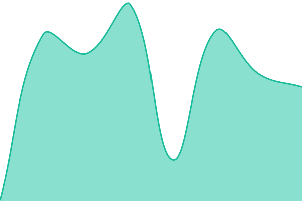 204ms
     
 | 

<a href="https://mhkarami97.github.io/uptime/history/mh-karami97-main-portfolio">100.00%</a>
    

|  [آی ترفند](https://tarfand.mhkarami97.ir) | 🟩 Up | [ay-trfnd.yml](https://github.com/MHKarami97/uptime/commits/HEAD/history/ay-trfnd.yml) | 

 179ms
     
 | 

<a href="https://mhkarami97.github.io/uptime/history/ay-trfnd">100.00%</a>
    

|  [وبلاگ](https://blog.mhkarami97.ir) | 🟩 Up | [wblag.yml](https://github.com/MHKarami97/uptime/commits/HEAD/history/wblag.yml) | 

 258ms
     
 | 

<a href="https://mhkarami97.github.io/uptime/history/wblag">100.00%</a>
    

|  [کتابخانه](https://book.mhkarami97.ir) | 🟩 Up | [ktabkhanh.yml](https://github.com/MHKarami97/uptime/commits/HEAD/history/ktabkhanh.yml) | 

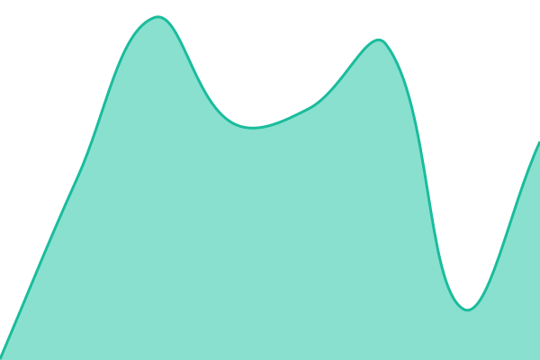 259ms
     
 | 

<a href="https://mhkarami97.github.io/uptime/history/ktabkhanh">100.00%</a>
    

|  [فیلم‌خانه](https://video.mhkarami97.ir) | 🟩 Up | [fylm-khanh.yml](https://github.com/MHKarami97/uptime/commits/HEAD/history/fylm-khanh.yml) | 

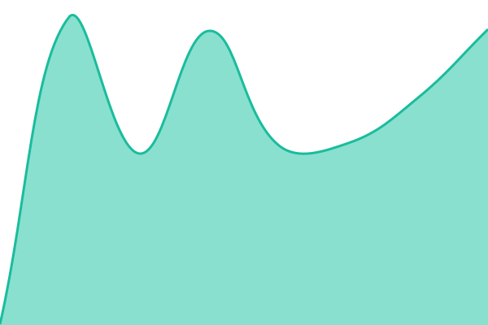 269ms
     
 | 

<a href="https://mhkarami97.github.io/uptime/history/fylm-khanh">100.00%</a>
    

|  [سفرنامه](https://travel.mhkarami97.ir) | 🟩 Up | [sfrnamh.yml](https://github.com/MHKarami97/uptime/commits/HEAD/history/sfrnamh.yml) | 

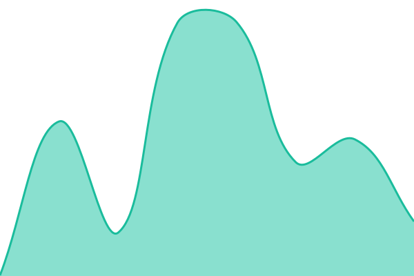 221ms
     
 | 

<a href="https://mhkarami97.github.io/uptime/history/sfrnamh">100.00%</a>
    

|  [کلیپ](https://trip.mhkarami97.ir) | 🟩 Up | [klyp.yml](https://github.com/MHKarami97/uptime/commits/HEAD/history/klyp.yml) | 

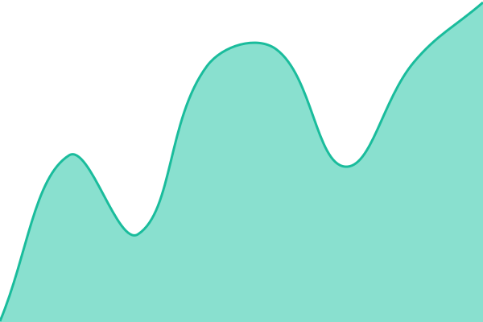 184ms
     
 | 

<a href="https://mhkarami97.github.io/uptime/history/klyp">100.00%</a>
    

|  [شعرخانه](https://poem.mhkarami97.ir) | 🟩 Up | [sherkhanh.yml](https://github.com/MHKarami97/uptime/commits/HEAD/history/sherkhanh.yml) | 

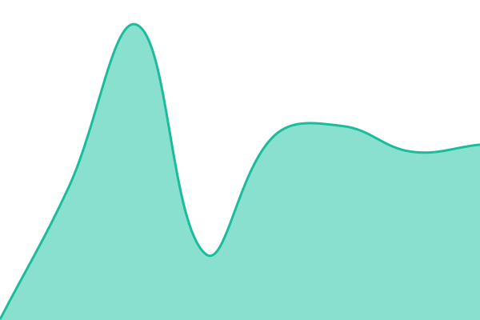 176ms
     
 | 

<a href="https://mhkarami97.github.io/uptime/history/sherkhanh">100.00%</a>
    

|  [فوت‌وفن](https://trick.mhkarami97.ir) | 🟩 Up | [fwt-wfn.yml](https://github.com/MHKarami97/uptime/commits/HEAD/history/fwt-wfn.yml) | 

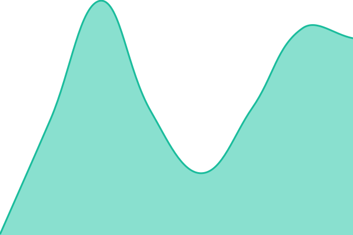 251ms
     
 | 

<a href="https://mhkarami97.github.io/uptime/history/fwt-wfn">100.00%</a>
    

|  [جملات انگیزشی](https://sentence.mhkarami97.ir) | 🟩 Up | [jmlat-angyzshy.yml](https://github.com/MHKarami97/uptime/commits/HEAD/history/jmlat-angyzshy.yml) | 

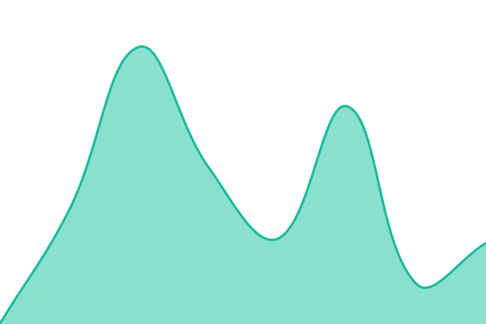 232ms
     
 | 

<a href="https://mhkarami97.github.io/uptime/history/jmlat-angyzshy">100.00%</a>
    

|  [لینکدونی](https://link.mhkarami97.ir) | 🟩 Up | [lynkdwny.yml](https://github.com/MHKarami97/uptime/commits/HEAD/history/lynkdwny.yml) | 

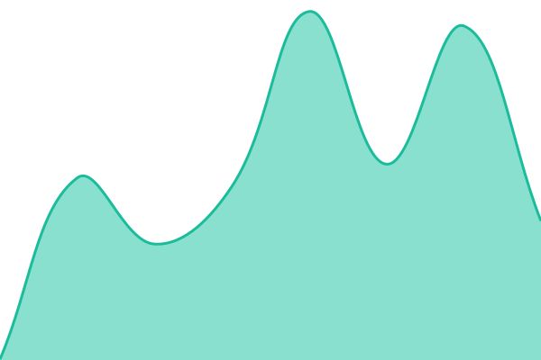 148ms
     
 | 

<a href="https://mhkarami97.github.io/uptime/history/lynkdwny">100.00%</a>
    

|  [ایونت](https://event.mhkarami97.ir) | 🟩 Up | [aywnt.yml](https://github.com/MHKarami97/uptime/commits/HEAD/history/aywnt.yml) | 

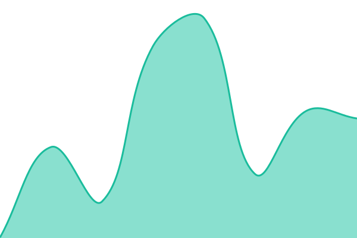 142ms
     
 | 

<a href="https://mhkarami97.github.io/uptime/history/aywnt">100.00%</a>
    

|  [فیلم آموزشی](https://film.mhkarami97.ir) | 🟩 Up | [fylm-amwzshy.yml](https://github.com/MHKarami97/uptime/commits/HEAD/history/fylm-amwzshy.yml) | 

 168ms
     
 | 

<a href="https://mhkarami97.github.io/uptime/history/fylm-amwzshy">100.00%</a>
    

|  [تجربه](https://experience.mhkarami97.ir) | 🟩 Up | [tjrbh.yml](https://github.com/MHKarami97/uptime/commits/HEAD/history/tjrbh.yml) | 

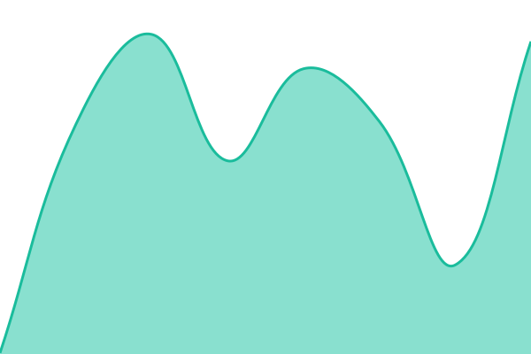 248ms
     
 | 

<a href="https://mhkarami97.github.io/uptime/history/tjrbh">100.00%</a>
    

|  [کلاس](https://learn.mhkarami97.ir) | 🟩 Up | [klas.yml](https://github.com/MHKarami97/uptime/commits/HEAD/history/klas.yml) | 

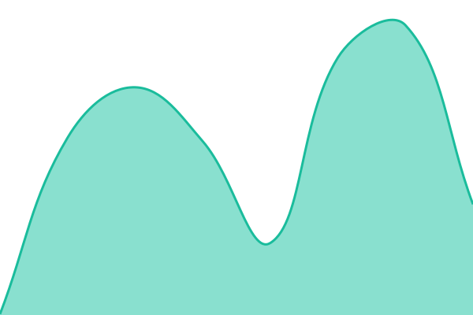 175ms
     
 | 

<a href="https://mhkarami97.github.io/uptime/history/klas">100.00%</a>
    

|  [دیکشنری](https://dictionary.mhkarami97.ir) | 🟩 Up | [dykshnry.yml](https://github.com/MHKarami97/uptime/commits/HEAD/history/dykshnry.yml) | 

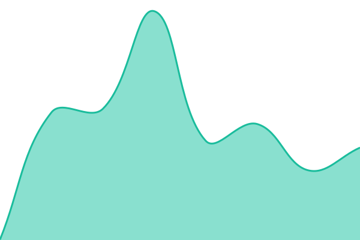 162ms
     
 | 

<a href="https://mhkarami97.github.io/uptime/history/dykshnry">100.00%</a>
    

|  [الگوریتم](https://algorithm.mhkarami97.ir) | 🟩 Up | [algwrytm.yml](https://github.com/MHKarami97/uptime/commits/HEAD/history/algwrytm.yml) | 

 201ms
     
 | 

<a href="https://mhkarami97.github.io/uptime/history/algwrytm">100.00%</a>
    

|  [لایف لیست](https://list.mhkarami97.ir) | 🟩 Up | [layf-lyst.yml](https://github.com/MHKarami97/uptime/commits/HEAD/history/layf-lyst.yml) | 

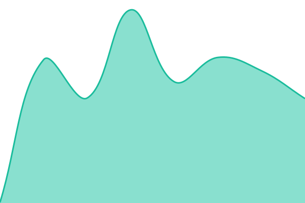 152ms
     
 | 

<a href="https://mhkarami97.github.io/uptime/history/layf-lyst">100.00%</a>
    

|  [پرامپ](https://prompt.mhkarami97.ir) | 🟩 Up | [pramp.yml](https://github.com/MHKarami97/uptime/commits/HEAD/history/pramp.yml) | 

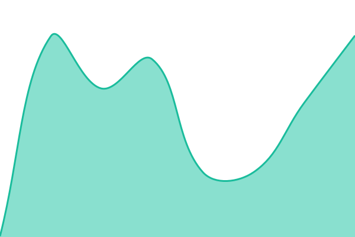 114ms
     
 | 

<a href="https://mhkarami97.github.io/uptime/history/pramp">100.00%</a>
    

|  [تاریخ](https://date.mhkarami97.ir) | 🟩 Up | [tarykh.yml](https://github.com/MHKarami97/uptime/commits/HEAD/history/tarykh.yml) | 

 144ms
     
 | 

<a href="https://mhkarami97.github.io/uptime/history/tarykh">100.00%</a>
    

|  [آموزش](https://teach.mhkarami97.ir) | 🟩 Up | [amwzsh.yml](https://github.com/MHKarami97/uptime/commits/HEAD/history/amwzsh.yml) | 

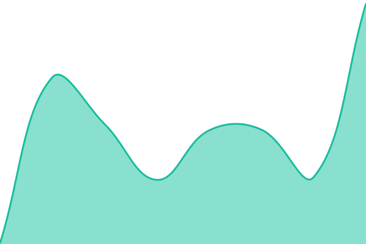 114ms
     
 | 

<a href="https://mhkarami97.github.io/uptime/history/amwzsh">100.00%</a>
    

|  [اقتصاد](https://economy.mhkarami97.ir) | 🟩 Up | [aqtsad.yml](https://github.com/MHKarami97/uptime/commits/HEAD/history/aqtsad.yml) | 

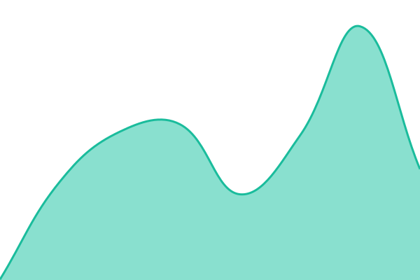 133ms
     
 | 

<a href="https://mhkarami97.github.io/uptime/history/aqtsad">100.00%</a>
    

|  [سیاست](https://politic.mhkarami97.ir) | 🟩 Up | [syast.yml](https://github.com/MHKarami97/uptime/commits/HEAD/history/syast.yml) | 

 90ms
     
 | 

<a href="https://mhkarami97.github.io/uptime/history/syast">100.00%</a>
    

|  [علمی](https://science.mhkarami97.ir) | 🟩 Up | [elmy.yml](https://github.com/MHKarami97/uptime/commits/HEAD/history/elmy.yml) | 

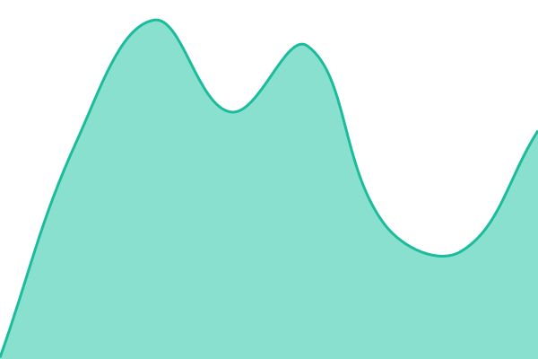 130ms
     
 | 

<a href="https://mhkarami97.github.io/uptime/history/elmy">100.00%</a>
    

|  [روانشناسی](https://person.mhkarami97.ir) | 🟩 Up | [rwanshnasy.yml](https://github.com/MHKarami97/uptime/commits/HEAD/history/rwanshnasy.yml) | 

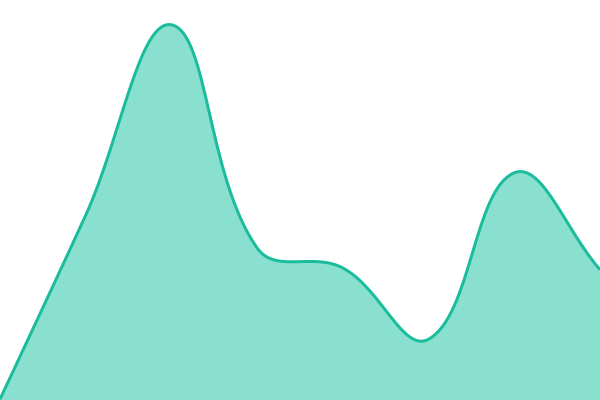 87ms
     
 | 

<a href="https://mhkarami97.github.io/uptime/history/rwanshnasy">100.00%</a>
    

|  [فرمول یک](https://f1.mhkarami97.ir) | 🟩 Up | [frmwl-yk.yml](https://github.com/MHKarami97/uptime/commits/HEAD/history/frmwl-yk.yml) | 

 85ms
     
 | 

<a href="https://mhkarami97.github.io/uptime/history/frmwl-yk">95.80%</a>
    

|  [Karam Travel](https://karamtravel.ir) | 🟩 Up | [karam-travel.yml](https://github.com/MHKarami97/uptime/commits/HEAD/history/karam-travel.yml) | 

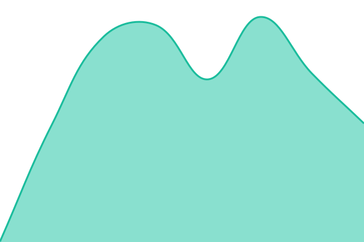 185ms
     
 | 

<a href="https://mhkarami97.github.io/uptime/history/karam-travel">100.00%</a>
    

|  [Tour](https://tour.mhkarami97.ir) | 🟩 Up | [tour.yml](https://github.com/MHKarami97/uptime/commits/HEAD/history/tour.yml) | 

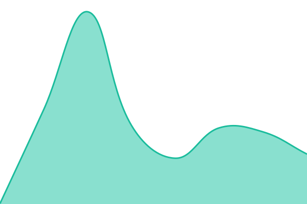 86ms
     
 | 

<a href="https://mhkarami97.github.io/uptime/history/tour">100.00%</a>
    

|  [Zoorvan (تجربه‌نامه)](https://zoorvan.ir) | 🟩 Up | [zoorvan-tjrbh-namh.yml](https://github.com/MHKarami97/uptime/commits/HEAD/history/zoorvan-tjrbh-namh.yml) | 

 237ms
     
 | 

<a href="https://mhkarami97.github.io/uptime/history/zoorvan-tjrbh-namh">100.00%</a>
    

|  [Shirdal Market](https://shirdalmarket.ir) | 🟩 Up | [shirdal-market.yml](https://github.com/MHKarami97/uptime/commits/HEAD/history/shirdal-market.yml) | 

 228ms
     
 | 

<a href="https://mhkarami97.github.io/uptime/history/shirdal-market">100.00%</a>
    

|  [YarKhoone](https://yarkhoone.ir) | 🟥 Down | [yar-khoone.yml](https://github.com/MHKarami97/uptime/commits/HEAD/history/yar-khoone.yml) | 

 0ms
     
 | 

<a href="https://mhkarami97.github.io/uptime/history/yar-khoone">0.01%</a>
    

|  [Chavooshan](https://chavooshan.ir) | 🟩 Up | [chavooshan.yml](https://github.com/MHKarami97/uptime/commits/HEAD/history/chavooshan.yml) | 

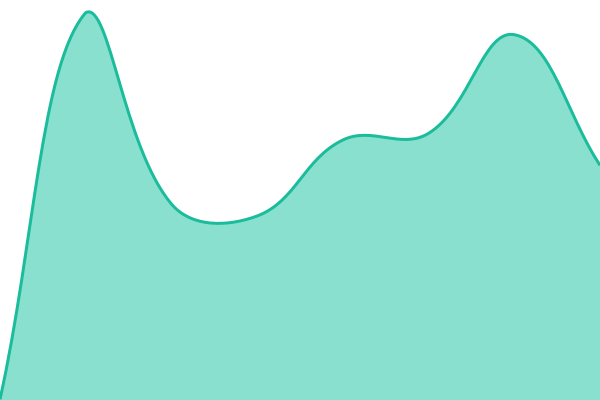 223ms
     
 | 

<a href="https://mhkarami97.github.io/uptime/history/chavooshan">100.00%</a>
    

|  [ZolfDota](https://zolfdota.ir) | 🟩 Up | [zolf-dota.yml](https://github.com/MHKarami97/uptime/commits/HEAD/history/zolf-dota.yml) | 

 238ms
     
 | 

<a href="https://mhkarami97.github.io/uptime/history/zolf-dota">100.00%</a>
    

|  [DorGardoon](https://dorgardoon.ir) | 🟩 Up | [dor-gardoon.yml](https://github.com/MHKarami97/uptime/commits/HEAD/history/dor-gardoon.yml) | 

 306ms
     
 | 

<a href="https://mhkarami97.github.io/uptime/history/dor-gardoon">100.00%</a>
    

|  [MolkRey](https://molkrey.ir) | 🟩 Up | [molk-rey.yml](https://github.com/MHKarami97/uptime/commits/HEAD/history/molk-rey.yml) | 

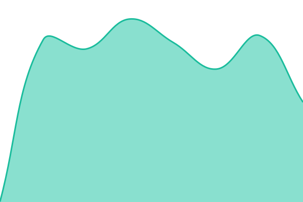 241ms
     
 | 

<a href="https://mhkarami97.github.io/uptime/history/molk-rey">100.00%</a>
    

|  [Zamaanak](https://zamaanak.ir) | 🟩 Up | [zamaanak.yml](https://github.com/MHKarami97/uptime/commits/HEAD/history/zamaanak.yml) | 

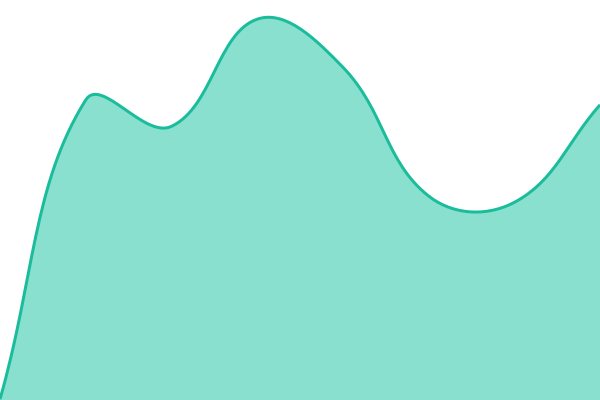 234ms
     
 | 

<a href="https://mhkarami97.github.io/uptime/history/zamaanak">100.00%</a>
    

|  [Hengam](https://hengam.zamaanak.ir) | 🟩 Up | [hengam.yml](https://github.com/MHKarami97/uptime/commits/HEAD/history/hengam.yml) | 

 220ms
     
 | 

<a href="https://mhkarami97.github.io/uptime/history/hengam">100.00%</a>
    

|  [Magic Box](https://magic.mhkarami97.ir) | 🟩 Up | [magic-box.yml](https://github.com/MHKarami97/uptime/commits/HEAD/history/magic-box.yml) | 

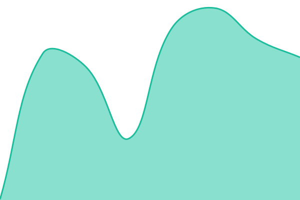 136ms
     
 | 

<a href="https://mhkarami97.github.io/uptime/history/magic-box">100.00%</a>
    

|  [Game Box](https://game.mhkarami97.ir) | 🟩 Up | [game-box.yml](https://github.com/MHKarami97/uptime/commits/HEAD/history/game-box.yml) | 

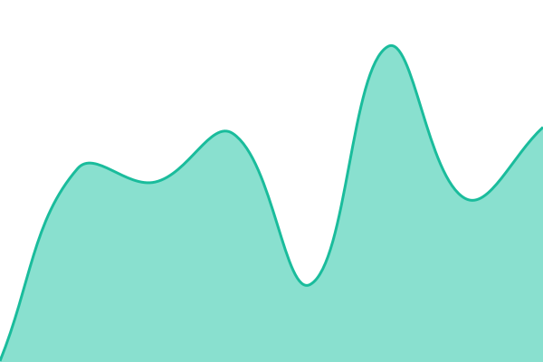 95ms
     
 | 

<a href="https://mhkarami97.github.io/uptime/history/game-box">100.00%</a>
    

|  [Tool Box (AI)](https://ai.mhkarami97.ir) | 🟩 Up | [tool-box-ai.yml](https://github.com/MHKarami97/uptime/commits/HEAD/history/tool-box-ai.yml) | 

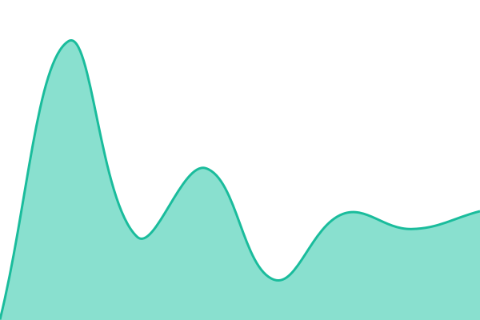 184ms
     
 | 

<a href="https://mhkarami97.github.io/uptime/history/tool-box-ai">100.00%</a>
    

|  [Calender](https://calender.mhkarami97.ir) | 🟩 Up | [calender.yml](https://github.com/MHKarami97/uptime/commits/HEAD/history/calender.yml) | 

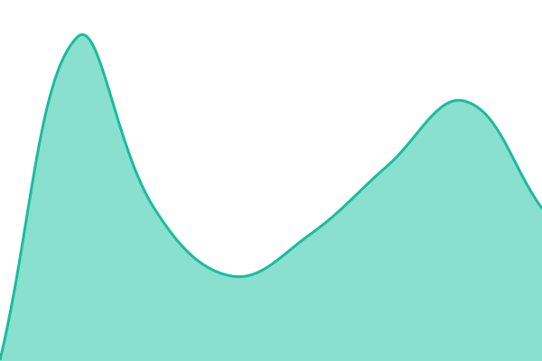 217ms
     
 | 

<a href="https://mhkarami97.github.io/uptime/history/calender">100.00%</a>
    

|  [Finance](https://finance.mhkarami97.ir) | 🟩 Up | [finance.yml](https://github.com/MHKarami97/uptime/commits/HEAD/history/finance.yml) | 

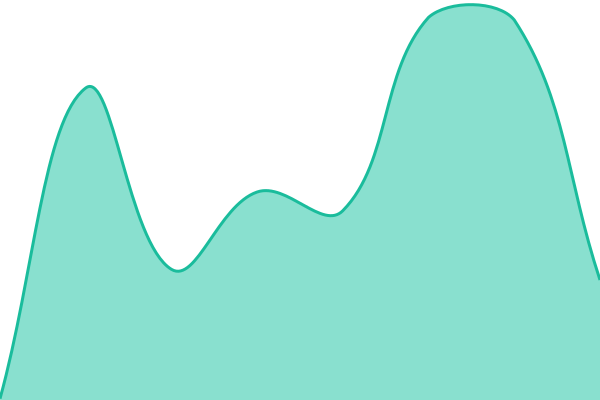 129ms
     
 | 

<a href="https://mhkarami97.github.io/uptime/history/finance">100.00%</a>
    

|  [Sport](https://sport.mhkarami97.ir) | 🟩 Up | [sport.yml](https://github.com/MHKarami97/uptime/commits/HEAD/history/sport.yml) | 

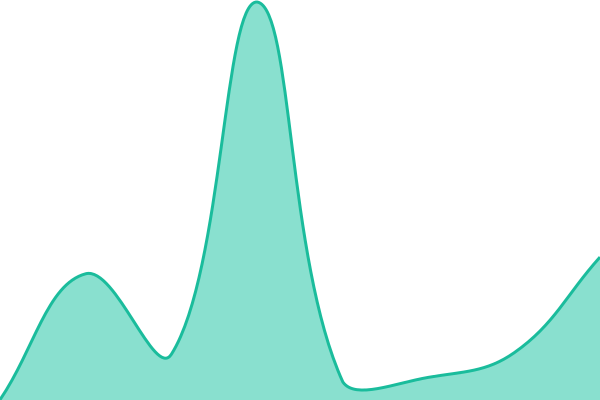 160ms
     
 | 

<a href="https://mhkarami97.github.io/uptime/history/sport">100.00%</a>
    

|  [Task](https://task.mhkarami97.ir) | 🟩 Up | [task.yml](https://github.com/MHKarami97/uptime/commits/HEAD/history/task.yml) | 

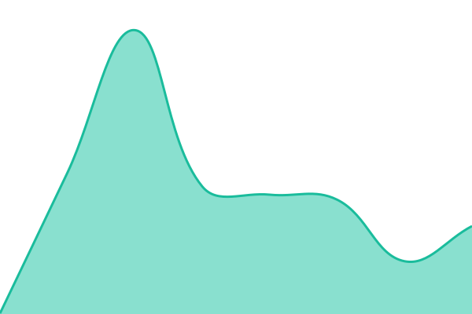 178ms
     
 | 

<a href="https://mhkarami97.github.io/uptime/history/task">100.00%</a>
    

|  [CheckList](https://checklist.mhkarami97.ir) | 🟩 Up | [check-list.yml](https://github.com/MHKarami97/uptime/commits/HEAD/history/check-list.yml) | 

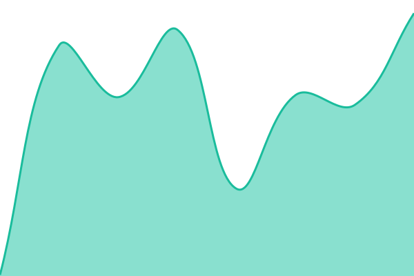 129ms
     
 | 

<a href="https://mhkarami97.github.io/uptime/history/check-list">100.00%</a>
    

|  [جعبه ابزار (App)](https://cafebazaar.ir/app/mhk.webtools) | 🟩 Up | [jebh-abzar-app.yml](https://github.com/MHKarami97/uptime/commits/HEAD/history/jebh-abzar-app.yml) | 

 1267ms
     
 | 

<a href="https://mhkarami97.github.io/uptime/history/jebh-abzar-app">100.00%</a>
    

|  [بدن ساز (App)](https://cafebazaar.ir/app/mhk.sport) | 🟩 Up | [bdn-saz-app.yml](https://github.com/MHKarami97/uptime/commits/HEAD/history/bdn-saz-app.yml) | 

 1239ms
     
 | 

<a href="https://mhkarami97.github.io/uptime/history/bdn-saz-app">100.00%</a>
    

|  [تقویم شمسی (App)](https://cafebazaar.ir/app/mhk.calender) | 🟩 Up | [tqwym-shmsy-app.yml](https://github.com/MHKarami97/uptime/commits/HEAD/history/tqwym-shmsy-app.yml) | 

 1276ms
     
 | 

<a href="https://mhkarami97.github.io/uptime/history/tqwym-shmsy-app">100.00%</a>
    

|  [تجربه‌نامه / زروان (App)](https://cafebazaar.ir/app/mhk.zoorvan) | 🟩 Up | [tjrbh-namh-zrwan-app.yml](https://github.com/MHKarami97/uptime/commits/HEAD/history/tjrbh-namh-zrwan-app.yml) | 

 1210ms
     
 | 

<a href="https://mhkarami97.github.io/uptime/history/tjrbh-namh-zrwan-app">100.00%</a>
    

|  [مدیریت مالی (App)](https://cafebazaar.ir/app/mhk.finance) | 🟩 Up | [mdyryt-maly-app.yml](https://github.com/MHKarami97/uptime/commits/HEAD/history/mdyryt-maly-app.yml) | 

 1315ms
     
 | 

<a href="https://mhkarami97.github.io/uptime/history/mdyryt-maly-app">100.00%</a>
    

|  [مدیریت کارها (App)](https://cafebazaar.ir/app/mhk.task) | 🟩 Up | [mdyryt-karha-app.yml](https://github.com/MHKarami97/uptime/commits/HEAD/history/mdyryt-karha-app.yml) | 

 1217ms
     
 | 

<a href="https://mhkarami97.github.io/uptime/history/mdyryt-karha-app">100.00%</a>
    

|  [چاوشان (App)](https://cafebazaar.ir/app/mhk.chavooshan) | 🟩 Up | [chawshan-app.yml](https://github.com/MHKarami97/uptime/commits/HEAD/history/chawshan-app.yml) | 

 1275ms
     
 | 

<a href="https://mhkarami97.github.io/uptime/history/chawshan-app">100.00%</a>
    

|  [زلف دوتا (App)](https://cafebazaar.ir/app/mhk.zolfdota) | 🟥 Down | [zlf-dwta-app.yml](https://github.com/MHKarami97/uptime/commits/HEAD/history/zlf-dwta-app.yml) | 

 1152ms
     
 | 

<a href="https://mhkarami97.github.io/uptime/history/zlf-dwta-app">0.00%</a>
    

|  [دور گردون (App)](https://cafebazaar.ir/app/mhk.dorgardoon) | 🟩 Up | [dwr-grdwn-app.yml](https://github.com/MHKarami97/uptime/commits/HEAD/history/dwr-grdwn-app.yml) | 

 2458ms
     
 | 

<a href="https://mhkarami97.github.io/uptime/history/dwr-grdwn-app">73.66%</a>
    

|  [چک لیست (App)](https://cafebazaar.ir/app/mhk.checklist) | 🟩 Up | [chk-lyst-app.yml](https://github.com/MHKarami97/uptime/commits/HEAD/history/chk-lyst-app.yml) | 

 2639ms
     
 | 

<a href="https://mhkarami97.github.io/uptime/history/chk-lyst-app">100.00%</a>
    

|  [ملک ری (App)](https://cafebazaar.ir/app/mhk.molkrey) | 🟥 Down | [mlk-ry-app.yml](https://github.com/MHKarami97/uptime/commits/HEAD/history/mlk-ry-app.yml) | 

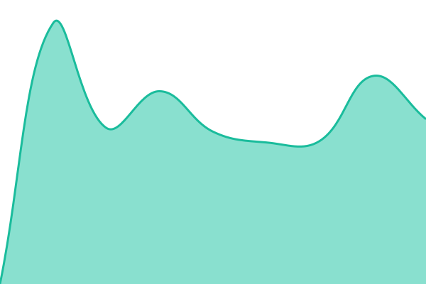 1474ms
     
 | 

<a href="https://mhkarami97.github.io/uptime/history/mlk-ry-app">0.00%</a>
    

|  [زمانک (App)](https://cafebazaar.ir/app/mhk.zamaanak) | 🟩 Up | [zmank-app.yml](https://github.com/MHKarami97/uptime/commits/HEAD/history/zmank-app.yml) | 

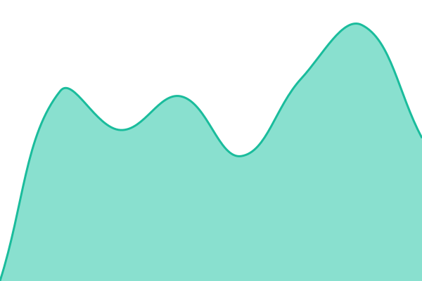 1650ms
     
 | 

<a href="https://mhkarami97.github.io/uptime/history/zmank-app">100.00%</a>
    

|  [هنگام (App)](https://cafebazaar.ir/app/mhk.hengam) | 🟩 Up | [hngam-app.yml](https://github.com/MHKarami97/uptime/commits/HEAD/history/hngam-app.yml) | 

 1222ms
     
 | 

<a href="https://mhkarami97.github.io/uptime/history/hngam-app">66.72%</a>
    

|  [جعبه بازی (Game)](https://cafebazaar.ir/app/mhk.gamebox) | 🟩 Up | [jebh-bazy-game.yml](https://github.com/MHKarami97/uptime/commits/HEAD/history/jebh-bazy-game.yml) | 

 1534ms
     
 | 

<a href="https://mhkarami97.github.io/uptime/history/jebh-bazy-game">100.00%</a>
    

|  [چیستا (Game)](https://cafebazaar.ir/app/mhk.chista) | 🟩 Up | [chysta-game.yml](https://github.com/MHKarami97/uptime/commits/HEAD/history/chysta-game.yml) | 

 1095ms
     
 | 

<a href="https://mhkarami97.github.io/uptime/history/chysta-game">100.00%</a>
    

|  [EasyMultiCacheManager (NuGet)](https://www.nuget.org/packages/EasyMultiCacheManager) | 🟩 Up | [easy-multi-cache-manager-nu-get.yml](https://github.com/MHKarami97/uptime/commits/HEAD/history/easy-multi-cache-manager-nu-get.yml) | 

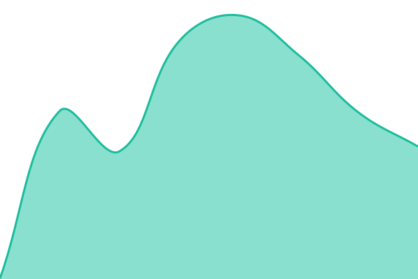 210ms
     
 | 

<a href="https://mhkarami97.github.io/uptime/history/easy-multi-cache-manager-nu-get">100.00%</a>
    

|  [EasyPersianNormalizer (NuGet)](https://www.nuget.org/packages/EasyPersianNormalizer) | 🟩 Up | [easy-persian-normalizer-nu-get.yml](https://github.com/MHKarami97/uptime/commits/HEAD/history/easy-persian-normalizer-nu-get.yml) | 

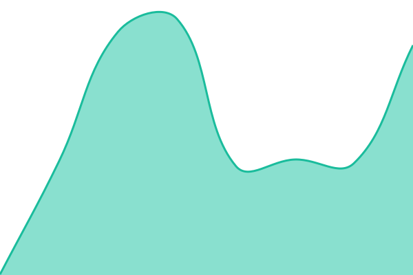 230ms
     
 | 

<a href="https://mhkarami97.github.io/uptime/history/easy-persian-normalizer-nu-get">100.00%</a>
    

|  [EasyPool (NuGet)](https://www.nuget.org/packages/EasyPool) | 🟩 Up | [easy-pool-nu-get.yml](https://github.com/MHKarami97/uptime/commits/HEAD/history/easy-pool-nu-get.yml) | 

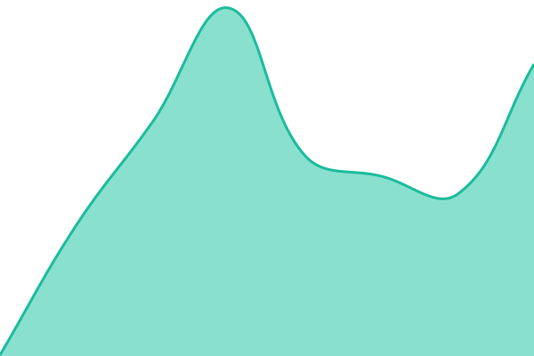 183ms
     
 | 

<a href="https://mhkarami97.github.io/uptime/history/easy-pool-nu-get">100.00%</a>
    

|  [SkipList (NuGet)](https://www.nuget.org/packages/SkipList) | 🟩 Up | [skip-list-nu-get.yml](https://github.com/MHKarami97/uptime/commits/HEAD/history/skip-list-nu-get.yml) | 

 195ms
     
 | 

<a href="https://mhkarami97.github.io/uptime/history/skip-list-nu-get">100.00%</a>
    

|  [New Tab (Extension)](https://microsoftedge.microsoft.com/addons/detail/%D8%AF%D8%A7%D8%B4%D8%A8%D9%88%D8%B1%D8%AF-%D9%81%D8%A7%D8%B1%D8%B3%DB%8C/mdnmgigpikijbhjenbjknhcnldebobpa) | 🟩 Up | [new-tab-extension.yml](https://github.com/MHKarami97/uptime/commits/HEAD/history/new-tab-extension.yml) | 

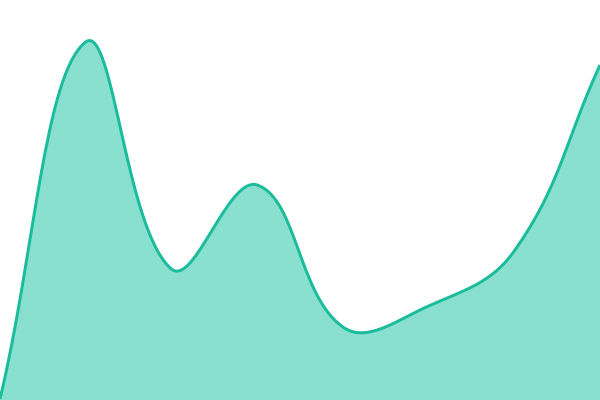 74ms
     
 | 

<a href="https://mhkarami97.github.io/uptime/history/new-tab-extension">100.00%</a>
    

|  [Font Changer (Extension)](https://microsoftedge.microsoft.com/addons/detail/font-changer-for-google-f/hhalocjgpdnjfoimnaaphihomijagcmo) | 🟩 Up | [font-changer-extension.yml](https://github.com/MHKarami97/uptime/commits/HEAD/history/font-changer-extension.yml) | 

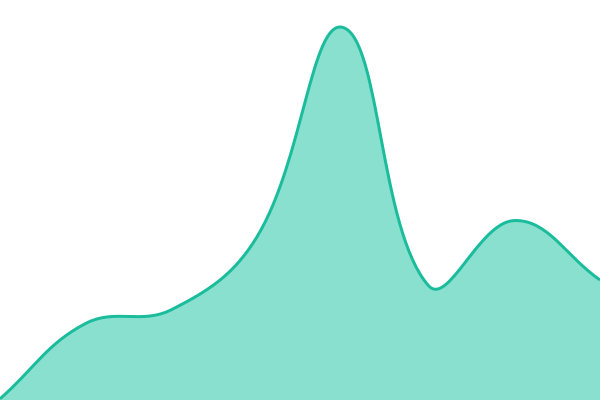 56ms
     
 | 

<a href="https://mhkarami97.github.io/uptime/history/font-changer-extension">100.00%</a>
    

|  [Easy Translate (Extension)](https://microsoftedge.microsoft.com/addons/detail/easy-translate/njddckflieienddodhibkddobipgaghg) | 🟩 Up | [easy-translate-extension.yml](https://github.com/MHKarami97/uptime/commits/HEAD/history/easy-translate-extension.yml) | 

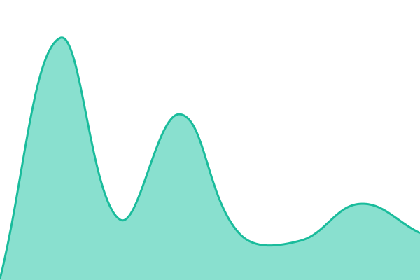 62ms
     
 | 

<a href="https://mhkarami97.github.io/uptime/history/easy-translate-extension">100.00%</a>
    

<!--end: status pages-->

[**Visit our status website →**](https://mhkarami97.github.io/uptime)

## 📄 License

- Powered by: [Upptime](https://github.com/upptime/upptime)
- Code: [MIT](./LICENSE) © [Anand Chowdhary](https://anandchowdhary.com)
- Data in the `./history` directory: [Open Database License](https://opendatacommons.org/licenses/odbl/1-0/)
